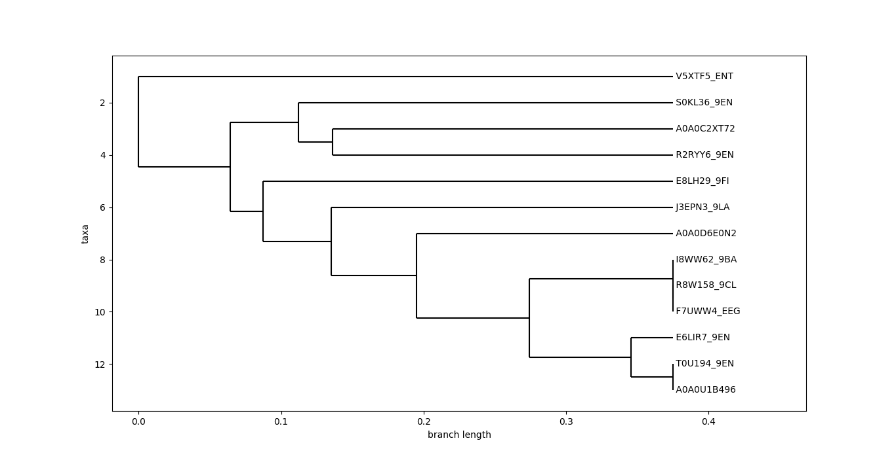

# UPGMA
Implementing UPGMA algorithm for building phylogenetic trees.

## INPUT

For input, we use a protein family aligned on phylip format such as the exaple below:

```
 13  92
J3EPN3_9LATLDYRKTFEIEIINEFQSAIHSKMLNYVLNNELDKSDSTNLQTNLLNQLS
E8LH29_9FI----------------------------MNHELNKNDSQLLEVNLLNQLK
A0A0D6E0N2ELNYEKTYQIEIINEFSSTVYNRVLNYVLNHELNTKDMTIVESNLLNQLE
R8W158_9CLAVTYEKTFEIEIINELSASVYNRVLNYVLNHELNKNDSQLLEVNLLNQLK
F7UWW4_EEGAVTYEKTFEIEIINELSASVYNRVLNYVLNHELNKNDSQLLEVNLLNQLK
I8WW62_9BAAVTYEKTFEIEIINELSASVYNRVLNYVLNHELNKNDSQLLEVNLLNQLK
T0U194_9ENAVTYEKTFEIEIINELSASVYNRVLNYVLNHELDTKNTRLLEVNLLNQLE
A0A0U1B496AVTYEKTFEIEIINELSASVYNRVLNYVLNHELDTKNTRLLEVNLLNQLE
E6LIR7_9ENAVTYEKTFEIEIINELSASVYNRVLNYVLNHELDTKNTRLLEVNLLNQLE
V5XTF5_ENT-MNYEQTERIESLNEFSKGITARLIAYLSKENIPIDTPNNFYVLLYQQFK
S0KL36_9ENKIDYELTAKIEIINEFSYGIYNRLLNYILNNGIDKNG-SNLYSAILSTLR
A0A0C2XT72KLDYDKTFKIEILNEFANGVYSRLLSFVLNNGMDRQDKNNPYNVLLDQFV
R2RYY6_9EN-MDYEKTFKIESLNEFSRNVYNRVLRYVVNHQIDRQNKNDLYAELLDQLK

DMNQINLFKLSLEELEAYHEYLRSIK---KYADSITRT----
LAKRVNLFDIKLRVVPLVQYVLDKAKENTSYC----------
VAQEVDLFKQSADELKAIDGYWIA---MDLYSKKLLIKQKVA
LAKRVNLFDYSLEELQAVHEYWRS---MNRYSKQVLNKEKVA
LAKRVNLFDYSLEELQAVHEYWRS---MNRYSKQVLNKEKVA
LAKRVNLFDYSLEELQAVHEYWRS---MNRYSKQVLNKEKVA
VAQEVDLFQQPFEELQAIHEYWRS---MNQYSKQILNKEKVA
VAQEVDLFQQPFEELQAIHEYWRS---MNQYSKQILNKEKVA
VAQEVDLFQQPFEELQAIHEYWRS---MNQYSKQIVEMSP--
EMLNLNLFSLSDTDLKRVEQYWQK---MNDLVSDISK-----
RMLSIDLFSYNRGELDKMLIYWKN---MNQYINEITDKVKTQ
EMLDINLFKMSFEELEVLEGYWKH---MNKYIREITK-----
GMLQMNLFEMSMSDLAKVESYWNA---MDVYTKSITDQKAVE
```

## RUN
Change this line of `upgma.py` code to the path of the file:

```python
166
167    DM = getDistanceMatrix('<path_to_file>')
167
```
Then, run:

```python
python upgma.py
```


## OUTPUT

The output must be a phylogenetic tree for this protein family. Here's the output from the above input:


